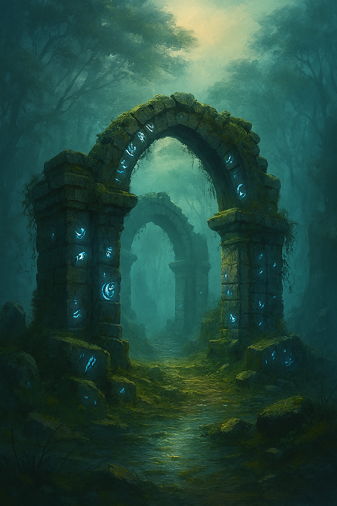

# 🧿 Seal of Solara

**Seal of Solara** is a browser-based adventure game built with Flask and JavaScript.  
Explore a mystical world, collect magical items, and unlock the ancient seal to restore light to the city.



---
Live Demo
Play it now: https://sealofsolara.onrender.com

## 🎮 Features

- 🌲 Explore interconnected scenes: forest, lake, mountain, ruins, cave, city
- 🧤 Grab items like keys, boots, scrolls, and the legendary seal
- 🪄 Use items to unlock paths and trigger cinematic transitions
- 🗣️ Talk to characters and uncover hidden lore
- 🔁 Cycle inventory and interact with the world dynamically
- ✨ Victory screen and restart option for replayability

---

## 🚀 How to Run Locally

```bash
# Clone the repo
git clone https://github.com/GabrielKnight13/seal-of-solara.git
cd seal-of-solara

# (Optional) Create a virtual environment
python -m venv venv
source venv/bin/activate  # or venv\Scripts\activate on Windows

# Install dependencies
pip install -r requirements.txt

# Run the game
python app.py

📜 License
This project is open-source under the MIT License. Feel free to fork, remix, and expand the world of Solara.
